# Xifratge de Dades i Verificació d’Integritat

**Projecte Nexus**

***

## 1. Objectiu de la Guia

Aquesta guia descriu de manera tècnica, clara i replicable els procediments utilitzats per garantir la **confidencialitat** i **integritat** de la informació del Projecte Nexus. S’hi apliquen:

*   **Xifratge simètric amb VeraCrypt**
*   **Hashing SHA‑256** per comprovar integritat

Entorn utilitzat: **Windows 11 en VirtualBox**.

***

## 2. Justificació Teòrica

### 2.1. Xifratge

El **xifratge** converteix dades llegibles en dades inintel·ligibles mitjançant una clau.  
Propietats principals:

*   **Reversible** (si es té la clau).
*   Garanteix la **confidencialitat**.
*   S’utilitza l’estàndard **AES‑256**, robust i àmpliament adoptat.

**Utilitat en entorn acadèmic:** protegeix exàmens, notes i documents interns de possibles filtracions.

***

### 2.2. Hashing

Una **funció hash** genera una empremta digital única i irreversible d’un fitxer.  
Propietats:

*   **Irreversible**
*   Cada canvi al fitxer produeix un hash completament diferent
*   Permet verificar **integritat**

**Utilitat:** detectar manipulacions en actes, notes i altres arxius sensibles.

***

# 3. Fase 1 — Xifratge amb VeraCrypt

## 3.1. Configuració del Volum Xifrat

Objectiu: crear un contenidor segur per emmagatzemar l’examen.

### Procediment:

1.  Instal·lar **VeraCrypt**.
2.  Obrir `Create Volume`.
3.  Seleccionar **Create an encrypted file container**.
4.  Triar **Standard VeraCrypt volume**.
5.  Assignar nom del volum:  
    `exam_nexus.vc`
6.  Configurar:
    *   **Xifratge:** AES‑256
    *   **Hash:** SHA‑512
7.  Mida del contenidor: **100 MB**
8.  Definir una contrasenya robusta.
9.  Generar entropia movent el ratolí i finalitzar.

**Evidències:**  
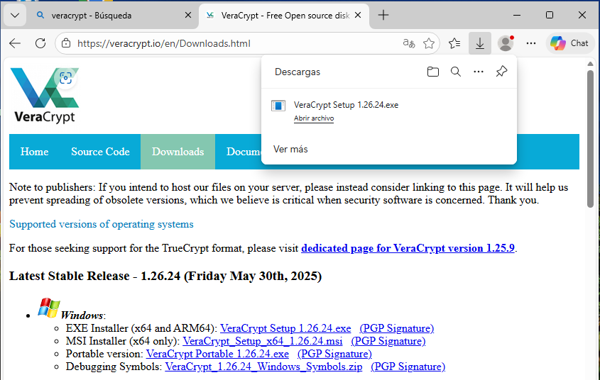
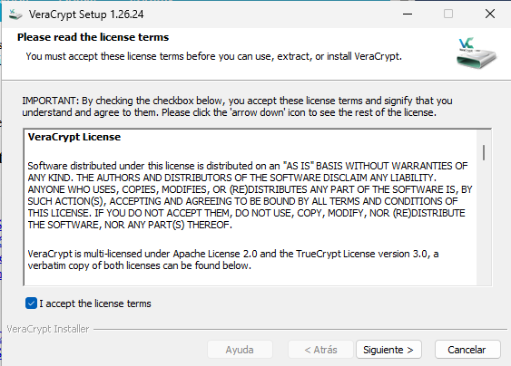
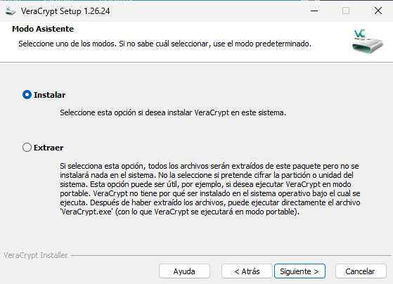
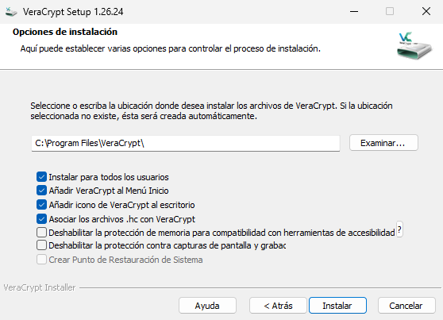
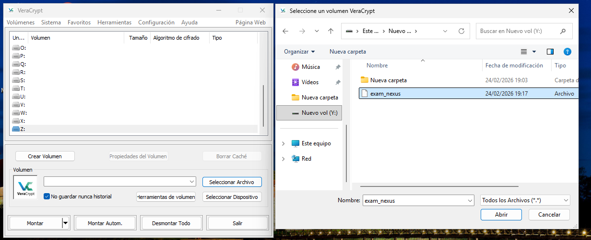
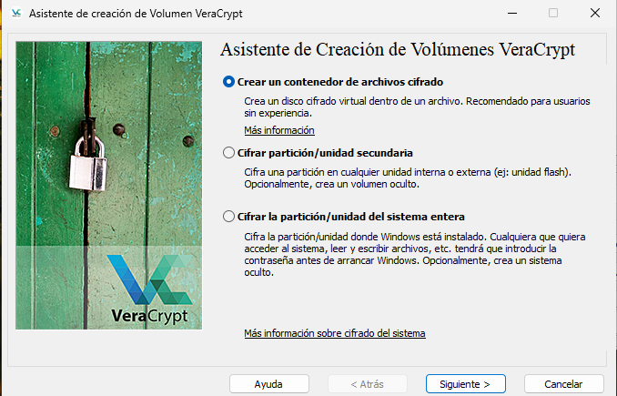
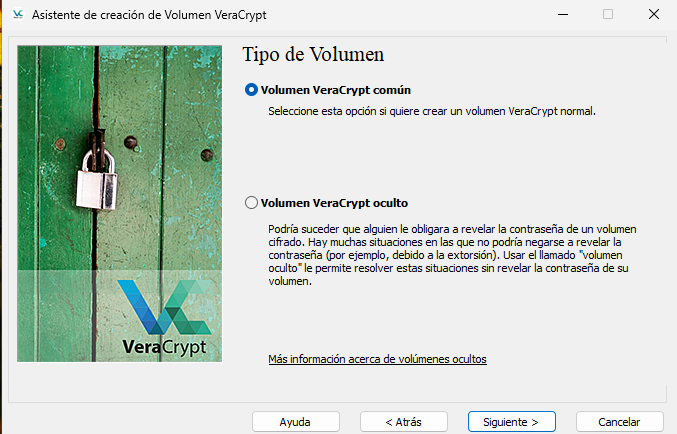
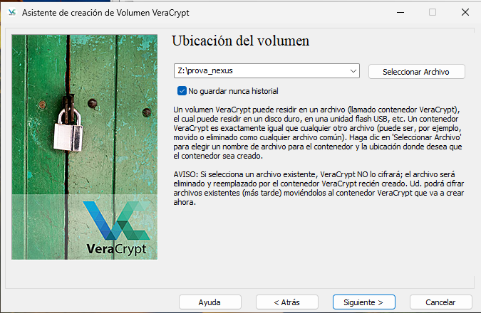
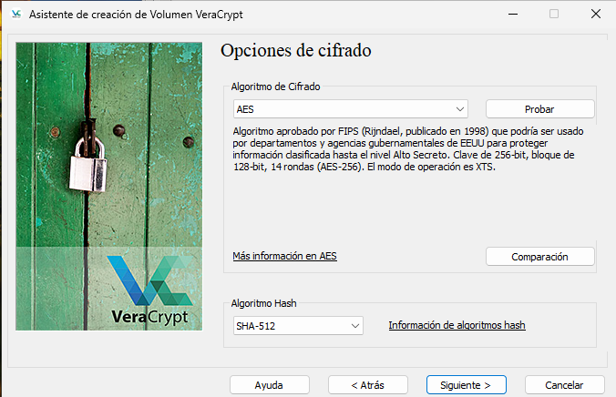
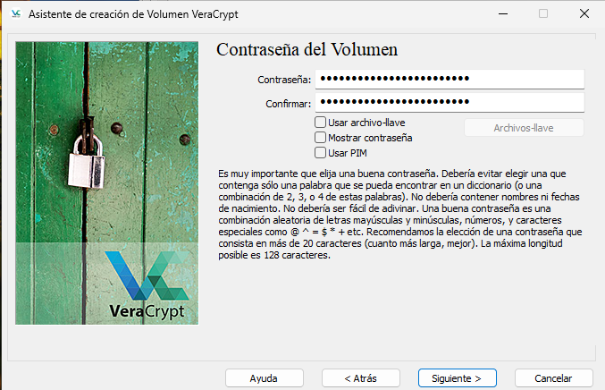
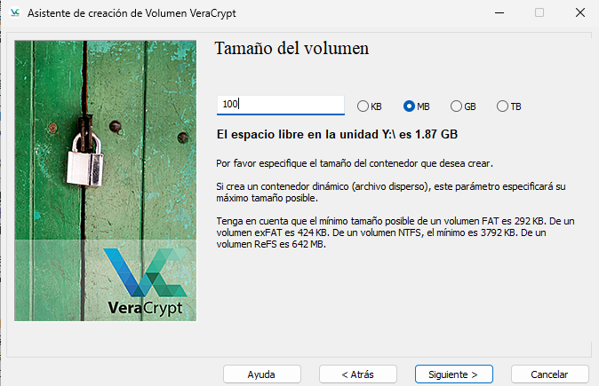
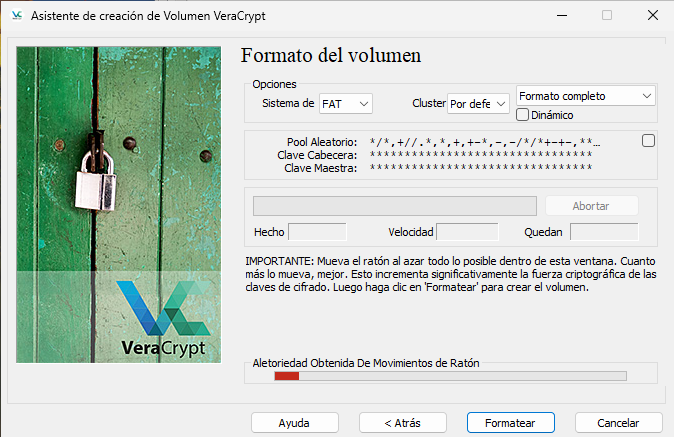

***

## 3.2. Muntatge del Volum i Creació de l’Examen

1.  A VeraCrypt, seleccionar una unitat lliure (ex. `X:`).
2.  Seleccionar el volum `exam_nexus.vc`.
3.  Fer clic a **Mount** i introduir la contrasenya.
4.  A la unitat muntada, crear:  
    `EXAMEN_FINAL_SEGURETAT.txt`
5.  Escriure-hi el contingut de l’examen.

**Evidència:**  
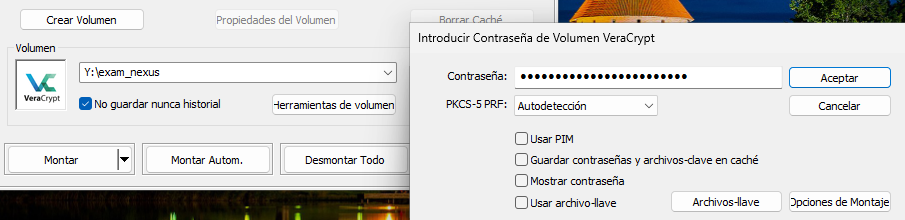

***

## 3.3. Verificació de la Confidencialitat

*   Amb el volum **muntat**, el fitxer és accessible.
*   Amb el volum **desmuntat**, el fitxer és inexistent per al sistema.

**Evidència:**  

***

# 4. Fase 2 — Hashing SHA‑256 amb CertUtil

## 4.1. Obtenció del Hash del Fitxer Original

Fitxer: `nota_final_curs.txt`  
Contingut inicial:

    L'alumne ha aprovat amb un 5

Comanda utilitzada:

    CertUtil -hashfile "ruta\nota_final_curs.txt" SHA256

**Evidències:**  
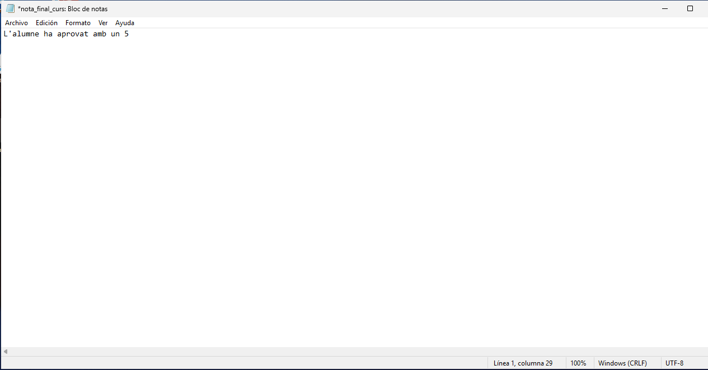
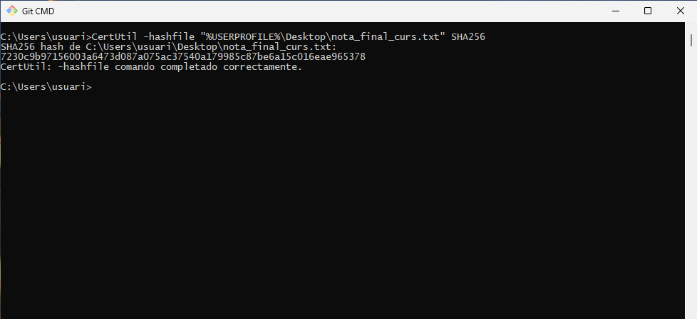

***

## 4.2. Obtenció del Hash després d’una Modificació

Nou contingut:

    L'alumne ha aprovat amb un 9

Nova execució:

    CertUtil -hashfile "ruta\nota_final_curs.txt" SHA256

**Evidències:**  
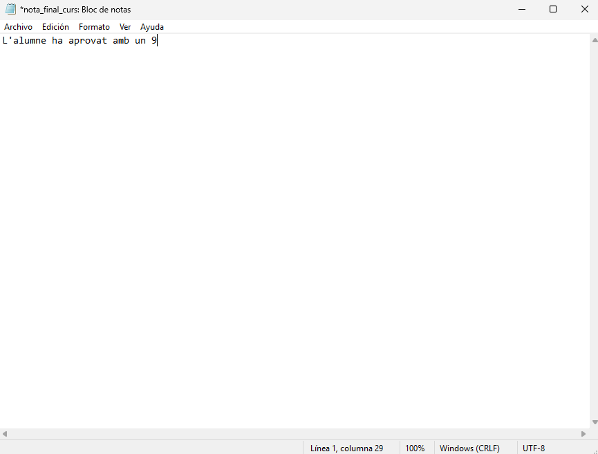
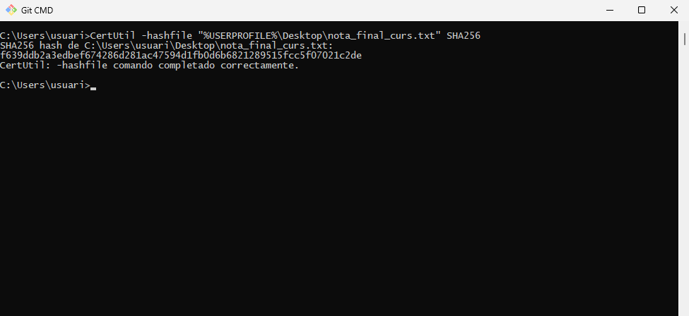

***

## 4.3. Resultats

*   Un canvi mínim al fitxer genera un hash completament diferent.
*   Es demostra la **propietat d’avalança**.
*   SHA‑256 és adequat per verificar la integritat de documents acadèmics.

***

# 5. Conclusions i Recomanacions

1.  **Protecció de dades sensibles**  
    L’ús d’AES‑256 evita filtracions d’exàmens i notes.

2.  **Contrasenyes robustes**  
    Recomanable utilitzar contrasenyes úniques i gestors de contrasenyes.

3.  **Verificació d’integritat**  
    SHA‑256 permet detectar alteracions en fitxers crítics.

4.  **Tècniques complementàries**
    *   Xifratge → *confidencialitat*
    *   Hashing → *integritat*  
        La seguretat completa requereix combinar ambdues tècniques.
